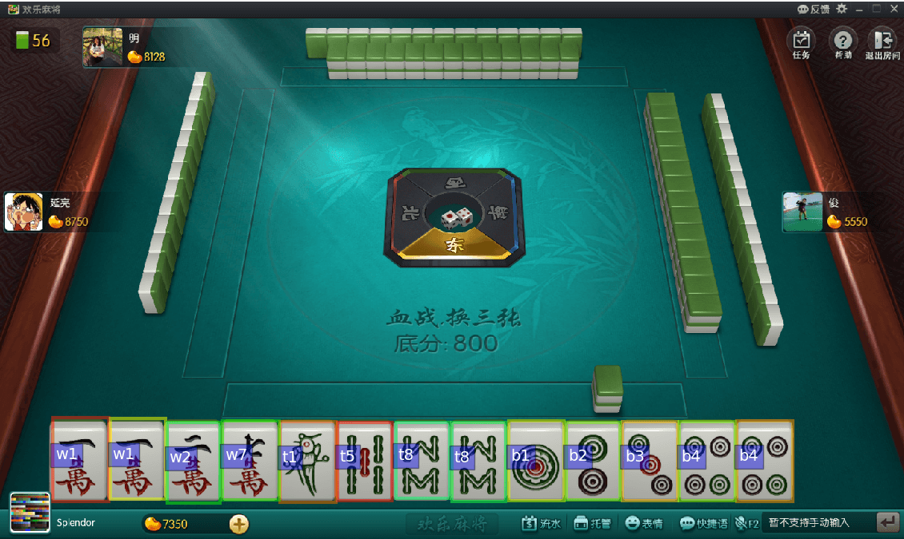

# MIRA(MIce RAiser the monkey)
the smart, moderate monkey let mice lie in their test bed

### TODO
* 1. hotspot-aware, segmentation
* 2. operation graph
* 3. interactive UI to fill the assert script

## sub-project: 麻将识别

### 1. 简介
为了论证基于图像识别的GUI自动化的可行性，先试试认出麻将。

### 2. 数据收集
数据来自于几个方面：  
* 1.QQ麻将，[天凤][^8]麻将  
使用[Sikuli][^9]脚本得到了一批截图，因为界面大小相对较固定，  
所以可用程序分割图像，然后用openCV识别标注。  
* 2.自己用Unity写的麻将程序  
因为程序完全受控，所以比较方便，只需要换贴图就可以。  
* 3.程序生成  
通过改变缩放，旋转，摆放位置，不同光照条件生成。  

**数据集格式PACAL VOC和tfrecord**

### 3. 训练
识别代码来自于项目[tf-faster-rcnn][^6]和[tensorflow object detection][^5]。  
它们都支持各种网络结构，如[vgg-net][^10]， [res-net][^11]等。

### 4. 效果

### 5. 坑
- 1.对于rcnn系的算法，目标的宽高比参数非常重要，直接影响区域推荐质量
- 2.对于麻将这个应用，NMS要将所有的类作为一个整体来做，不能按单独每个类来做
- 3.透视变换引起的问题，因为有些角度透视后对象的宽高比和预定的参数差异较大
- 4.有的情况下会有半透明的overlay层，对算法影响较大

### 6. 下一步想做的
* 1.试验下[yolo][^12]，主要因为[faster-rcnn][^6]还是不够快
* 2.透视矫正
* 3.测试在现实情况下的识别效果

[^5]: https://github.com/tensorflow/models/tree/master/object_detection
[^6]: https://github.com/endernewton/tf-faster-rcnn
[^8]: http://tenhou.net/
[^9]: http://www.sikuli.org/
[^10]: https://arxiv.org/abs/1409.1556
[^11]: https://arxiv.org/abs/1512.03385
[^12]: https://pjreddie.com/darknet/yolo/
